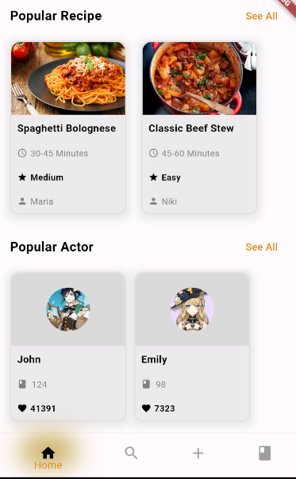

# Implementasi UI UAS Mobpro

#Implementasi UI aplikasi Pencarian resep

Pembuatan implementasi UI ini memiliki kemiripan sebesar 95% dimana terdapat beberapa data yang berbeda dengan hasil aslinya. Diantaranya seperti
1). Foto Profil
2). Foto "Popular Recipes"
3). Foto "Popular Actor" 
4). Perbedaan model footer
5). Perbedaan Icon pada aplikasi

untuk kesesuaian dapat dibandingkan secara langsung dengan cloning aplikasi ini

# cara menjalankan kode
1). git clone <https://github.com/Abghipraya/UIUASMobpro.git>
2). masuk kedalam VSC atau Aplikasi pemprograman
3). Run (flutter pub get)
4). Buka Emulator
5). Run Without Debugging.
